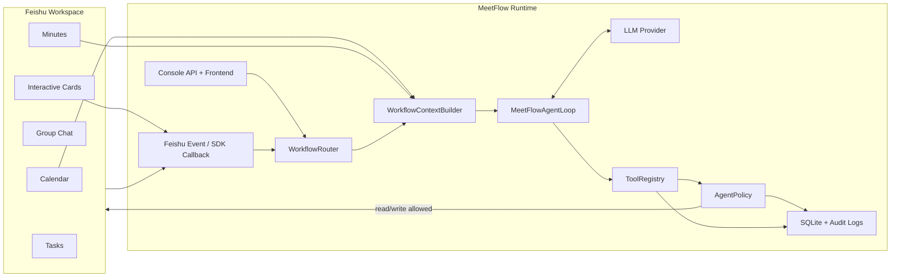
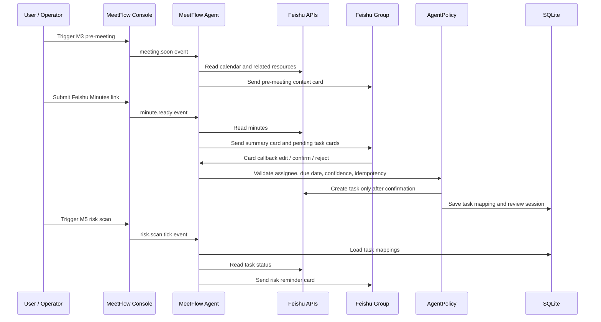
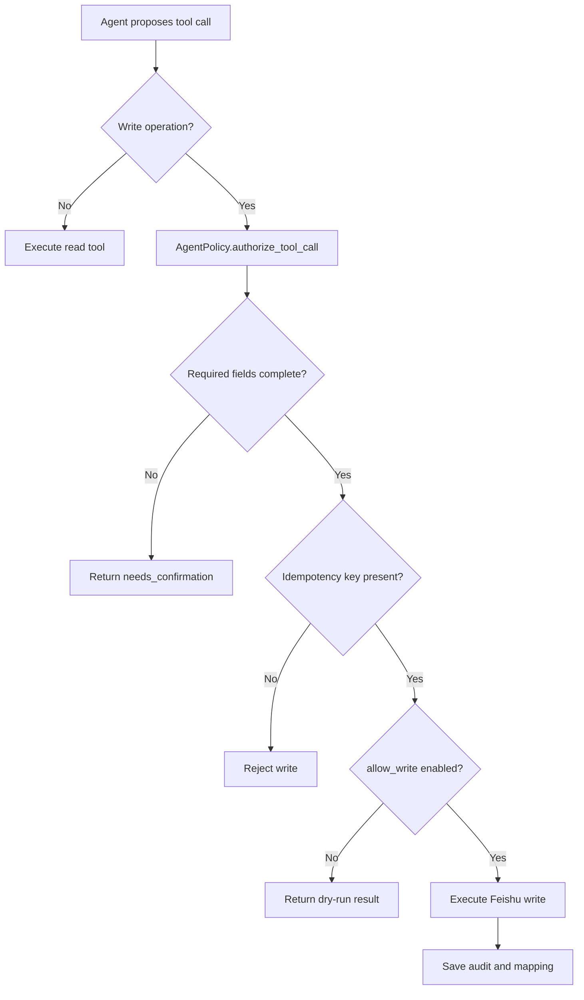

# MeetFlow

> A Feishu-native meeting workflow agent for pre-meeting context, post-meeting follow-up, human task confirmation, and risk scanning.


MeetFlow is not just a meeting-summary script. It is a vertical business agent for real Feishu collaboration scenes. It understands meeting context, calls tools through a controlled registry, sends interactive cards to a real group chat, waits for human confirmation before creating tasks, and keeps scanning follow-up risks after the meeting.

## Highlights

- **Feishu-native workflow**: calendar, minutes, group chat, interactive cards, card callbacks, task creation, and bot reminders.
- **Agentic orchestration**: `WorkflowRouter -> WorkflowContextBuilder -> MeetFlowAgentLoop -> ToolRegistry`.
- **Safe side effects**: all write operations go through `AgentPolicy`, idempotency keys, field completeness checks, and explicit `--allow-write`.
- **One-click live console**: start services, trigger M3/M4/M5 flows, inspect stdout, jobs, review sessions, task mappings, and risk notifications.
- **Demo-friendly but testable**: dry-run first, then real Feishu write mode; local SQLite keeps a replayable audit trail.

## Quick Links

| Area | What to open |
| --- | --- |
| Console backend | `scripts/meetflow_console_server.py` |
| Frontend console | `frontend/src/pages/LiveFlowPage.tsx` |
| Agent runtime | `core/agent_loop.py`, `core/tools.py`, `core/policy.py` |
| Feishu adapters | `adapters/feishu_client.py`, `adapters/feishu_tools.py` |
| M3 pre-meeting | `core/pre_meeting.py`, `cards/pre_meeting.py` |
| M4 post-meeting | `core/post_meeting.py`, `cards/post_meeting.py`, `core/card_callback.py` |
| M5 risk scan | `core/risk_scan.py`, `cards/risk_scan.py` |
| Local tests | `tests/` |

## Screenshots

Add screenshots to `assets/screenshots/` before publishing the repository. Recommended filenames:

| Screenshot | Suggested file |
| --- | --- |
| MeetFlow Console live-test page | `assets/screenshots/console-live-flow.png` |
| Feishu M3 pre-meeting card | `assets/screenshots/feishu-pre-meeting-card.png` |
| Feishu M4 pending task confirmation card | `assets/screenshots/feishu-task-confirm-card.png` |
| Feishu M5 risk reminder card | `assets/screenshots/feishu-risk-card.png` |

After adding images, uncomment or adapt this block:

```md


```

## Architecture



## Workflow



## Why MeetFlow

Typical meeting automation stops at reminders or a text summary. Real office meetings need a closed loop:

1. **Before the meeting**: prepare context from calendar, documents, and project memory.
2. **After the meeting**: understand decisions, open questions, and action items from Feishu Minutes.
3. **During collaboration**: ask humans to confirm assignee and due date before creating tasks.
4. **After execution starts**: scan overdue, due-soon, stale, and missing-owner risks.

MeetFlow separates responsibilities clearly:

- **LLM** understands unstructured meeting content and proposes structured actions.
- **Agent** builds context, plans tool calls, and continues reasoning after tool results.
- **ToolRegistry** exposes only approved tools to the agent.
- **AgentPolicy** controls writes, idempotency, completeness, and confirmation requirements.
- **Feishu adapters** encapsulate real API details and keep tokens out of business logic.

## Quick Start

### 1. Prepare Python

```bash
cd /path/to/meetflow-open-source
python3 -m venv .venv
source .venv/bin/activate
pip install --upgrade pip
pip install -r requirements.txt
```

### 2. Prepare local config

```bash
cp config/settings.example.json config/settings.local.json
cp config/llm_providers.example.json config/llm_providers.local.json
```

Edit local files only:

- `config/settings.local.json`: Feishu `app_id`, `app_secret`, test `default_chat_id`, OAuth tokens.
- `config/llm_providers.local.json`: DeepSeek / OpenAI-compatible provider settings.

Local secret files are ignored by Git.

### 3. Initialize storage

```bash
python scripts/storage_migrate.py --verify
```

### 4. Run safe dry-run checks

```bash
python scripts/agent_demo.py --event-type meeting.soon --plan-only
python scripts/agent_demo.py --event-type meeting.soon --backend local --llm-provider scripted_debug
python -m unittest discover
```

## Start The Console

Terminal 1: backend API

```bash
python scripts/meetflow_console_server.py --host 127.0.0.1 --port 8787
```

Terminal 2: frontend

```bash
cd frontend
npm install
npm run dev -- --host 127.0.0.1 --port 5173
```

Open:

```text
http://127.0.0.1:5173
```

The console can:

- run M3 pre-meeting card tests;
- read a Feishu Minutes link and generate M4 summary / task cards;
- start worker and callback services;
- inspect jobs, logs, review sessions, task mappings, and M5 risk notifications.

## Real Feishu Integration

### OAuth device login

```bash
python scripts/oauth_device_login.py
```

### Feishu SDK callback environment

The card callback path uses `lark-oapi`. To avoid dependency conflicts, create an isolated venv:

```bash
python scripts/setup_lark_oapi_venv.py --recreate
.venv-lark-oapi/bin/python scripts/feishu_event_sdk_server.py \
  --enqueue-agent \
  --agent-provider dry-run \
  --job-queue workflow \
  --log-level info
```

### M4 post-meeting live test

Read minutes only:

```bash
python scripts/post_meeting_live_test.py \
  --minute "https://your-domain.feishu.cn/minutes/your-minute-token" \
  --identity user
```

Send cards to a test group:

```bash
python scripts/post_meeting_live_test.py \
  --minute "https://your-domain.feishu.cn/minutes/your-minute-token" \
  --identity user \
  --chat-id "replace-with-your-test-chat-id" \
  --allow-write
```

Write mode must be explicit. Do not send to production groups while testing.

## Safety Model



Policy checks protect the system from:

- creating tasks without assignee or due date;
- duplicate task creation;
- accidental group messages;
- low-confidence LLM outputs;
- direct writes that bypass the tool registry.

## Repository Layout

```text
meetflow-open-source/
├── adapters/      # Feishu client, event payload normalization, Feishu tools
├── cards/         # Feishu interactive card builders
├── config/        # Config loader and safe example config files
├── core/          # Agent runtime, policy, storage, workflows, risk scan, console API
├── frontend/      # React + Vite console
├── scripts/       # Local demos, live tests, service entrypoints
├── storage/       # Runtime data directory; real data is ignored
├── tests/         # Unit tests and replay fixtures
├── tools/         # Reserved for tool definitions/extensions
└── workflows/     # Reserved workflow package
```

## Development Checks

```bash
python -m py_compile core/*.py adapters/*.py cards/*.py scripts/*.py config/*.py
python -m unittest discover
cd frontend && npm run build
```

If `npm` is not installed, the backend and tests can still run; install Node.js 20+ before building the frontend.

## Privacy Checklist Before Publishing

Run these commands before pushing to a public repository:

```bash
git status --short --ignored
git check-ignore -v \
  config/settings.local.json \
  config/llm_providers.local.json \
  storage/meetflow.sqlite \
  storage/workflow_events.jsonl \
  storage/post_meeting_pending_actions.json \
  storage/runtime
rg -n "(access_token|refresh_token|app_secret|api_key|oc_[a-z0-9]{16,}|om_[a-z0-9]{16,}|feishu.cn/minutes/obcn)" .
```

The final `rg` command may match safe placeholder text or tests. Review every match before publishing.

## Roadmap

- End-to-end demo session replay in the console.
- More visible M4 task review board.
- Richer M5 risk rule configuration.
- Multi-project memory isolation.
- Better public screenshots and architecture assets.
