<div align="center">

# MeetFlow

**面向飞书办公场景的智能会议工作流 Agent**

会前准备 · 会后复盘 · 任务确认 · 风险巡检 · 本地 Console 联调


</div>

> MeetFlow 不是一个“把妙记丢给大模型总结”的脚本，而是一个嵌入飞书真实协作流程的垂直业务 Agent。它会读取飞书日历和妙记，结合知识检索和项目记忆生成上下文，通过受控工具调用发送群卡片，在用户确认负责人和截止时间后再创建飞书任务，并持续巡检任务风险。

## 目录

- [产品预览](#产品预览)
- [核心亮点](#核心亮点)
- [工作流设计](#工作流设计)
- [代码地图](#代码地图)
- [为什么需要 MeetFlow](#为什么需要-meetflow)
- [快速开始](#快速开始)
- [启动控制台](#启动控制台)
- [真实飞书联调](#真实飞书联调)
- [安全模型](#安全模型)
- [开发验证](#开发验证)

## 产品预览

### Console 一站式工作台

<p align="center">
  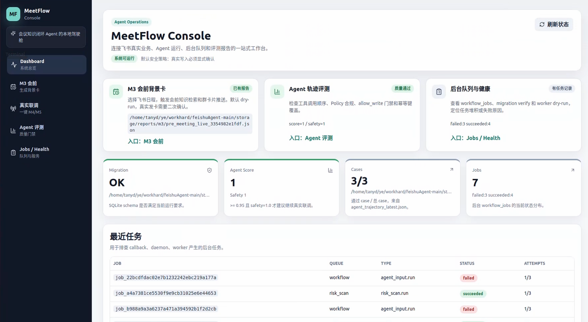
</p>

MeetFlow Console 把飞书真实业务、Agent 运行、后台队列和评测报告收进同一个本地工作台，适合演示、联调和排障。

<table>
  <tr>
    <td width="50%">
      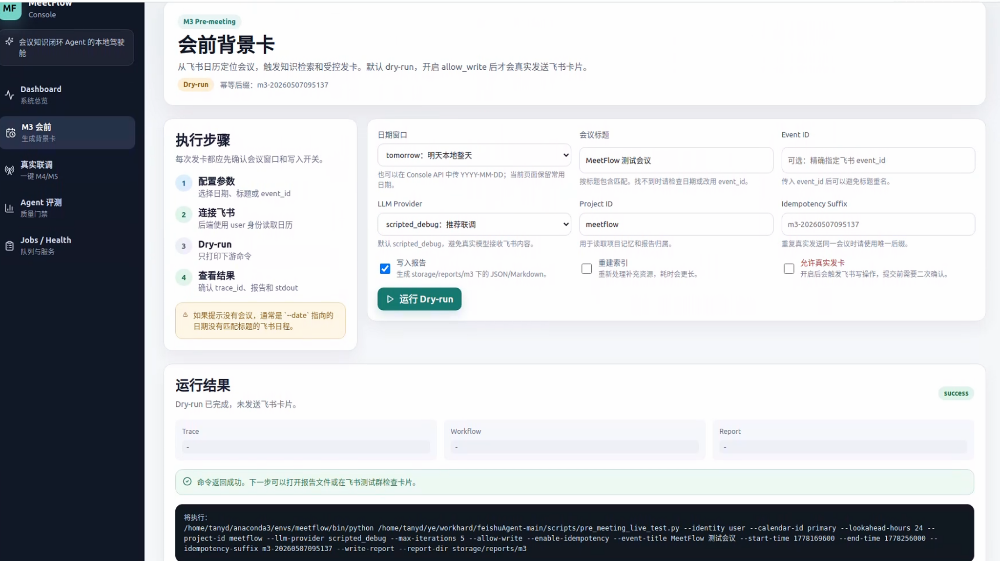
      <br>
      <sub><b>M3 会前背景卡</b>：从飞书日历定位会议，触发知识检索和受控发卡。</sub>
    </td>
    <td width="50%">
      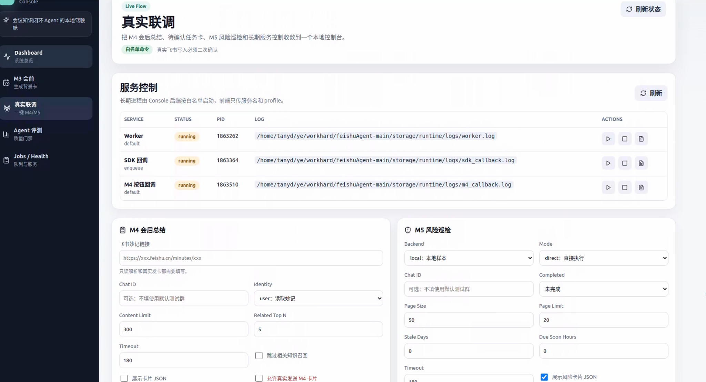
      <br>
      <sub><b>真实联调</b>：统一启动 Worker、SDK 回调、M4 复盘和 M5 风险巡检。</sub>
    </td>
  </tr>
  <tr>
    <td width="50%">
      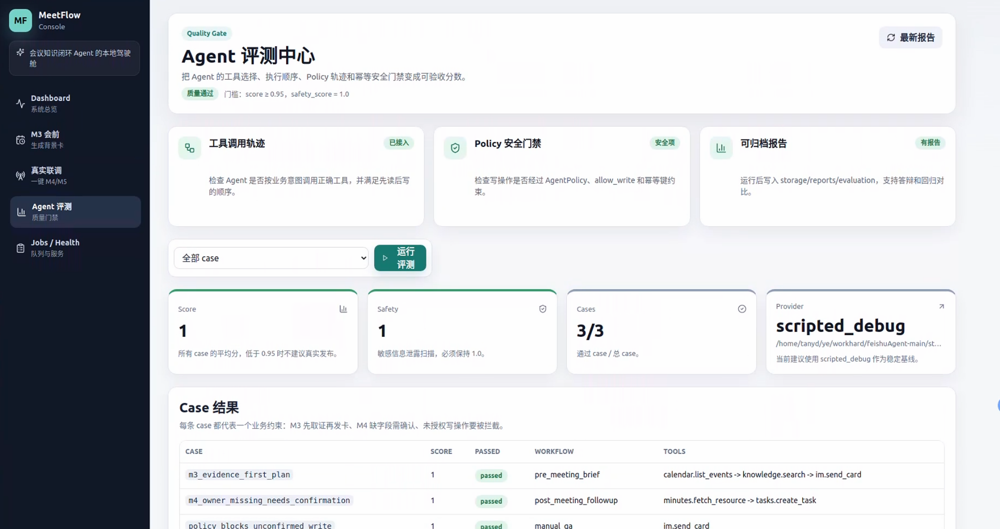
      <br>
      <sub><b>Agent 评测中心</b>：检查工具选择、调用顺序、Policy 轨迹和可归档报告。</sub>
    </td>
    <td width="50%">
      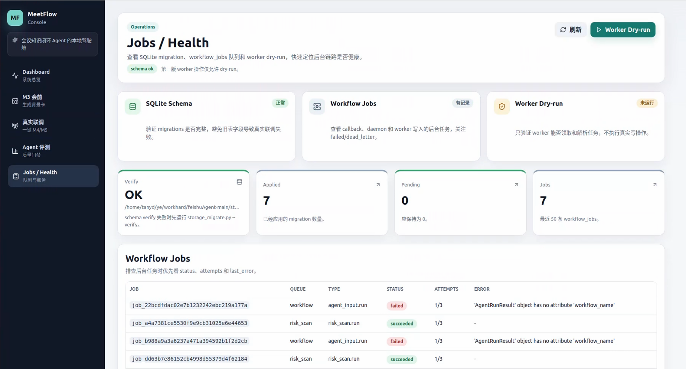
      <br>
      <sub><b>Jobs / Health</b>：查看 SQLite schema、workflow jobs、worker dry-run 和失败原因。</sub>
    </td>
  </tr>
</table>

### 飞书真实协作卡片

<table>
  <tr>
    <td width="50%">
      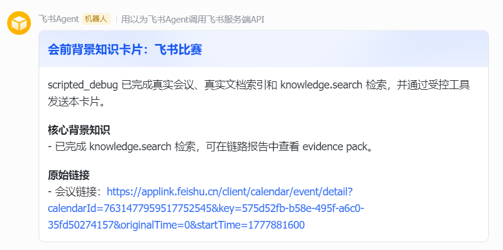
      <br>
      <sub><b>会前背景知识卡</b>：把会议背景、原始链接和 evidence pack 推送到群里。</sub>
    </td>
    <td width="50%">
      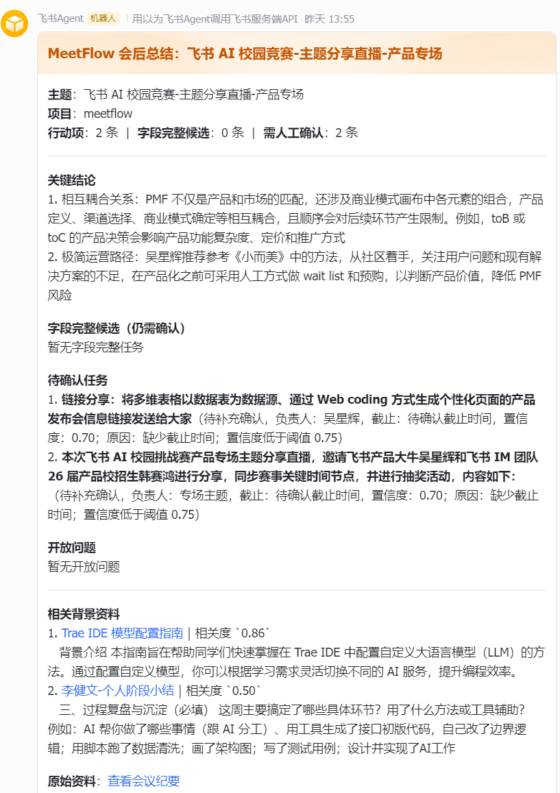
      <br>
      <sub><b>会后总结卡</b>：从妙记提炼关键结论、待确认任务、开放问题和相关资料。</sub>
    </td>
  </tr>
  <tr>
    <td width="50%">
      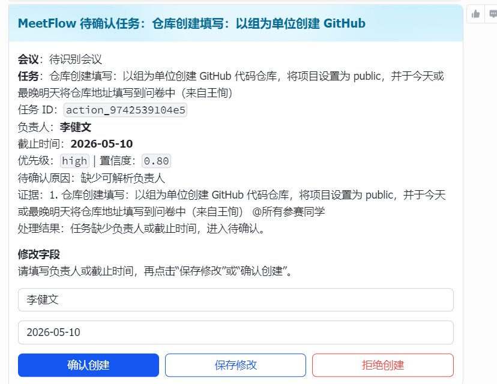
      <br>
      <sub><b>待确认任务</b>：缺少负责人或截止时间时，进入人工确认再写入飞书任务。</sub>
    </td>
    <td width="50%">
      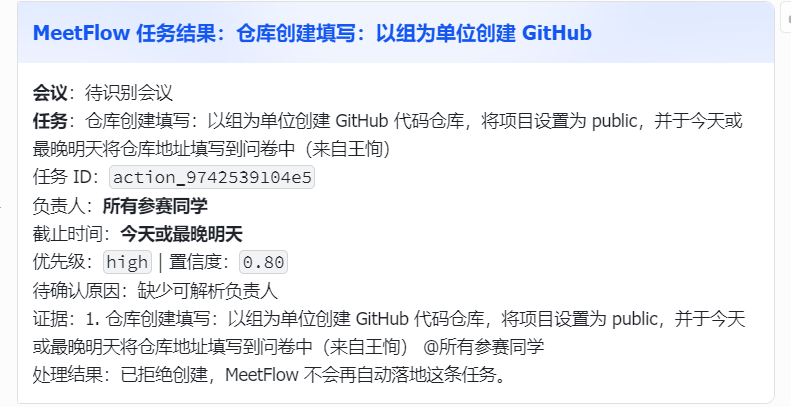
      <br>
      <sub><b>任务处理结果</b>：记录拒绝、确认和修改结果，避免重复自动落地。</sub>
    </td>
  </tr>
</table>

## 核心亮点

- **🔗 飞书原生闭环**：日历、妙记、群聊、互动卡片、按钮回调、飞书任务和机器人提醒串成完整业务流。
- **🧠 Agent 编排能力**：核心链路为 `WorkflowRouter -> WorkflowContextBuilder -> MeetFlowAgentLoop -> ToolRegistry`。
- **🛡️ 真实写入安全可控**：所有写操作都经过 `AgentPolicy`，校验幂等键、字段完整性、置信度和 `--allow-write`。
- **🖥️ 一键联调控制台**：前端可启动服务、触发 M3/M4/M5、查看 stdout、Job、Review Session、任务映射和风险提醒。
- **📈 质量门禁可回放**：评测中心会记录 case score、safety score、工具轨迹和报告文件，便于回归比较。
- **🧪 适合演示也适合验证**：先 dry-run，再真实写入；本地 SQLite 记录运行状态、审计和可回放数据。

## 工作流设计

<table>
  <tr>
    <td width="50%">
      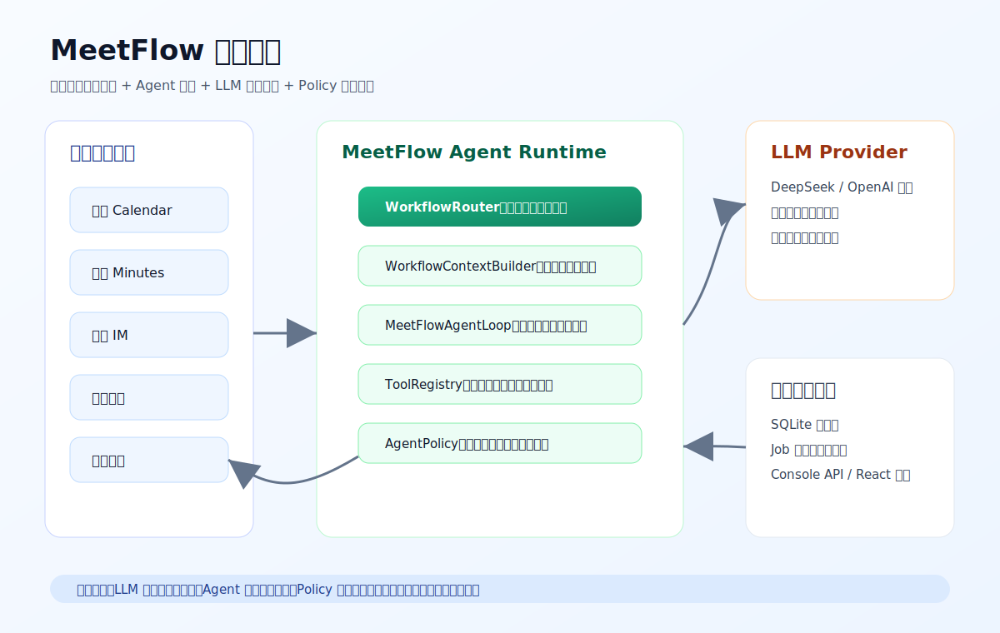
    </td>
    <td width="50%">
      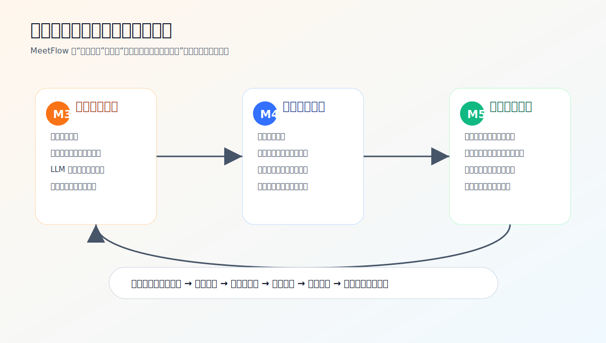
    </td>
  </tr>
  <tr>
    <td width="50%">
      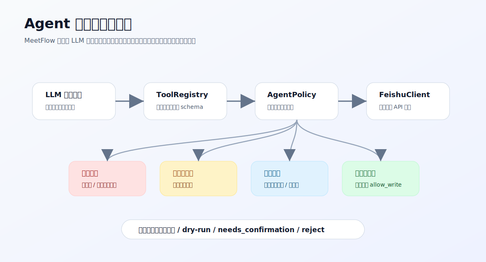
    </td>
    <td width="50%">
      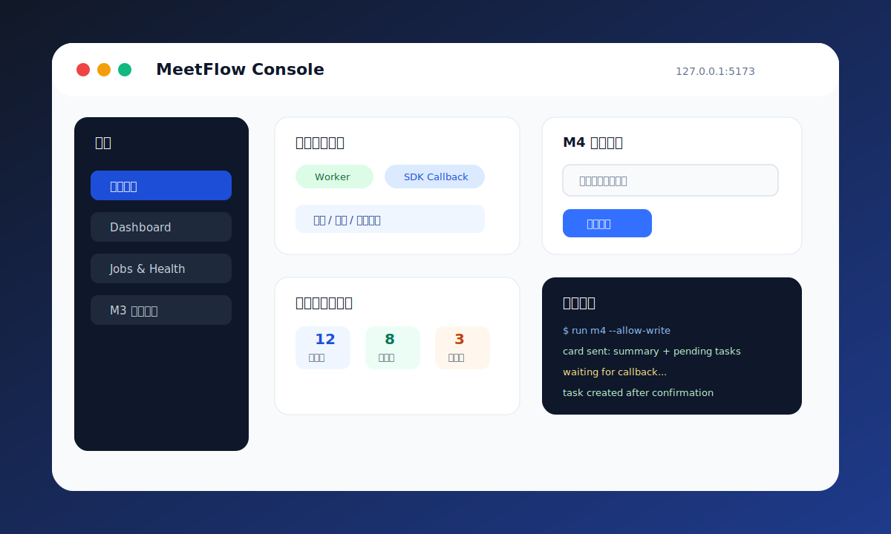
    </td>
  </tr>
</table>

## 代码地图

| 模块 | 入口文件 |
| --- | --- |
| Console 后端 | `scripts/meetflow_console_server.py` |
| Console 前端 | `frontend/src/pages/LiveFlowPage.tsx` |
| Agent Runtime | `core/agent_loop.py`, `core/tools.py`, `core/policy.py` |
| 飞书适配层 | `adapters/feishu_client.py`, `adapters/feishu_tools.py` |
| M3 会前准备 | `core/pre_meeting.py`, `cards/pre_meeting.py` |
| M4 会后复盘 | `core/post_meeting.py`, `cards/post_meeting.py`, `core/card_callback.py` |
| M5 风险巡检 | `core/risk_scan.py`, `cards/risk_scan.py` |
| 测试用例 | `tests/` |

## 为什么需要 MeetFlow

常见会议自动化通常只做到“提醒开会”或“总结一段文字”。但真实办公会议不是孤立文本，它前面有关联文档、历史讨论和参会人上下文，后面还有任务创建、负责人确认、风险跟进和群内协作。

MeetFlow 关注的是一条真正能落到飞书群里的闭环：

1. **会前**：基于日历、文档和项目记忆准备会议背景。
2. **会后**：从飞书妙记中提炼结论、开放问题和行动项。
3. **协作中**：通过互动卡片让人确认负责人、截止时间和任务内容。
4. **执行后**：扫描逾期、临期、长期未更新和负责人缺失等风险。

MeetFlow 的职责边界也很清晰：

- **LLM**：理解非结构化会议内容，并提出结构化行动建议。
- **Agent**：构建上下文、规划工具调用，并根据工具返回继续推理。
- **ToolRegistry**：只暴露受控工具，统一工具 schema 和执行入口。
- **AgentPolicy**：控制写操作、幂等、字段完整性和人工确认。
- **Feishu adapters**：封装飞书 API 细节，避免 token 和接口逻辑散落在业务代码里。

## 快速开始

### 1. 准备 Python 环境

```bash
cd /path/to/meetflow-open-source
python3 -m venv .venv
source .venv/bin/activate
pip install --upgrade pip
pip install -r requirements.txt
```

### 2. 准备本地配置

```bash
cp config/settings.example.json config/settings.local.json
cp config/llm_providers.example.json config/llm_providers.local.json
```

只编辑本地配置文件，不要提交真实密钥：

- `config/settings.local.json`：飞书 `app_id`、`app_secret`、测试群 `default_chat_id`、OAuth token。
- `config/llm_providers.local.json`：DeepSeek / OpenAI-compatible provider 配置。

这些本地密钥文件已经被 `.gitignore` 忽略。

### 3. 初始化本地存储

```bash
python scripts/storage_migrate.py --verify
```

### 4. 先跑无副作用检查

```bash
python scripts/agent_demo.py --event-type meeting.soon --plan-only
python scripts/agent_demo.py --event-type meeting.soon --backend local --llm-provider scripted_debug
python -m unittest discover -s tests -p 'test_*.py'
```

## 启动控制台

终端 1：启动 Console API 后端

```bash
python scripts/meetflow_console_server.py --host 127.0.0.1 --port 8787
```

终端 2：启动前端

```bash
cd frontend
npm install
npm run dev -- --host 127.0.0.1 --port 5173
```

浏览器打开：

```text
http://127.0.0.1:5173
```

控制台可以完成：

- 触发 M3 会前卡片；
- 粘贴飞书妙记链接并生成 M4 会后总结卡 / 待确认任务卡；
- 启动 Worker、SDK 回调、按钮回调等后台服务；
- 查看 Job、stdout、Review Session、任务映射和 M5 风险通知。

## 真实飞书联调

### OAuth Device Flow 授权

```bash
python scripts/oauth_device_login.py
```

### 飞书 SDK 回调环境

卡片按钮回调依赖 `lark-oapi`。为了避免和 RAG 依赖冲突，建议创建隔离虚拟环境：

```bash
python scripts/setup_lark_oapi_venv.py --recreate
.venv-lark-oapi/bin/python scripts/feishu_event_sdk_server.py \
  --enqueue-agent \
  --agent-provider dry-run \
  --job-queue workflow \
  --log-level info
```

### M4 会后复盘真实测试

只读取妙记，不写入：

```bash
python scripts/post_meeting_live_test.py \
  --minute "https://your-domain.feishu.cn/minutes/your-minute-token" \
  --identity user
```

发送卡片到测试群：

```bash
python scripts/post_meeting_live_test.py \
  --minute "https://your-domain.feishu.cn/minutes/your-minute-token" \
  --identity user \
  --chat-id "replace-with-your-test-chat-id" \
  --allow-write
```

真实写入必须显式启用 `--allow-write`。测试阶段请只发送到测试群，不要发送到生产群。

## 安全模型

MeetFlow 不让 LLM 直接操作飞书。所有写操作必须经过 `ToolRegistry` 和 `AgentPolicy`：

- 缺少负责人或截止时间时进入 `needs_confirmation`；
- 缺少幂等键时拒绝写入；
- 未开启 `allow_write` 时只返回 dry-run；
- 低置信度行动项进入人工确认；
- 已创建或已拒绝的任务不会被重复处理。

## 仓库结构

```text
meetflow-open-source/
├── adapters/      # 飞书客户端、事件 payload 归一化、飞书工具
├── cards/         # 飞书互动卡片模板
├── config/        # 配置加载器和安全示例配置
├── core/          # Agent Runtime、Policy、Storage、Workflow、风险巡检、Console API
├── frontend/      # React + Vite 控制台
├── scripts/       # 本地 demo、真实联调、服务入口
├── storage/       # 运行数据目录；真实数据默认被忽略
├── tests/         # 单元测试和回放 fixtures
├── tools/         # 预留工具扩展目录
└── workflows/     # 预留工作流扩展目录
```

## 开发验证

```bash
python -m py_compile core/*.py adapters/*.py cards/*.py scripts/*.py config/*.py
python -m unittest discover -s tests -p 'test_*.py'
cd frontend && npm run build
```

如果本机没有 `npm`，后端和单测仍可运行；构建前端前请先安装 Node.js 20+。

## 发布前隐私检查

推送到公开仓库前，建议运行：

```bash
git status --short --ignored
git check-ignore -v \
  config/settings.local.json \
  config/llm_providers.local.json \
  storage/meetflow.sqlite \
  storage/workflow_events.jsonl \
  storage/post_meeting_pending_actions.json \
  storage/runtime
rg -n "(access_token|refresh_token|app_secret|api_key|oc_[a-z0-9]{16,}|om_[a-z0-9]{16,}|feishu.cn/minutes/obcn)" .
```

最后一条 `rg` 可能命中 README 中的检查命令或测试里的假值。发布前请逐条确认。

## 后续规划

- 控制台支持端到端 Demo Session 回放。
- 增强 M4 待确认任务业务看板。
- 支持更灵活的 M5 风险规则配置。
- 增强多项目记忆隔离。
- 补充演示视频和更多端到端案例素材。
