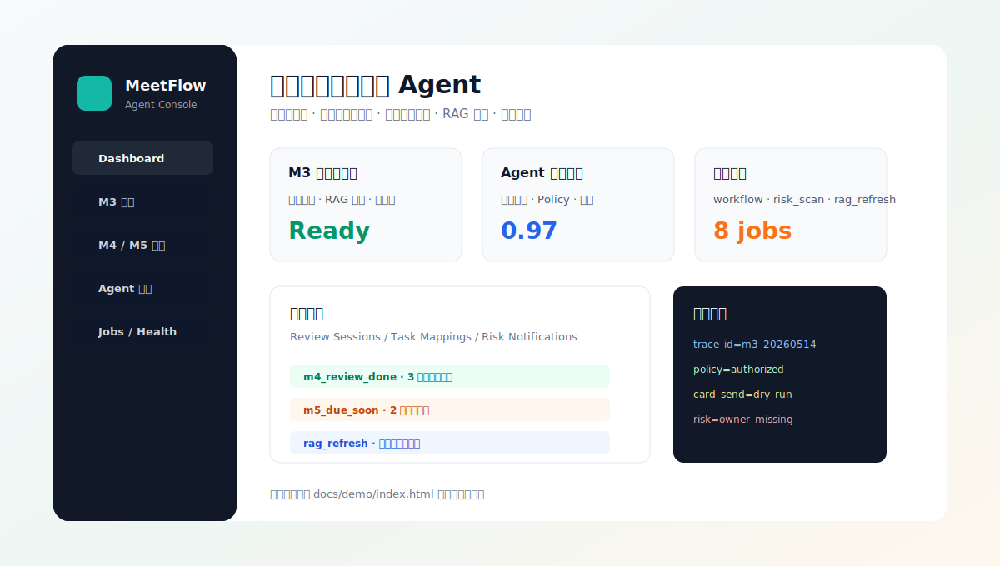
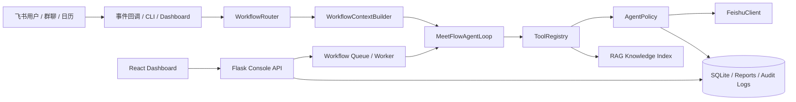

<!-- markdownlint-disable MD033 MD041 -->

<p align="center">
  
</p>

<p align="center">
  <a href="."></a>
  <a href="."></a>
  <a href="#-%E5%BC%80%E6%BA%90%E4%B8%8E%E8%B4%A1%E7%8C%AE"></a>
  <a href="#-%E5%BC%80%E6%BA%90%E4%B8%8E%E8%B4%A1%E7%8C%AE"></a>
</p>

<p align="center">
  
  
  
  
  
</p>

<p align="center">
  <a href="#-%E9%9D%99%E6%80%81%E5%89%8D%E7%AB%AF%E6%BC%94%E7%A4%BA">前端演示</a>
  ·
  <a href="#-%E6%A0%B8%E5%BF%83%E5%8A%9F%E8%83%BD">核心功能</a>
  ·
  <a href="#-%E5%BF%AB%E9%80%9F%E5%BC%80%E5%A7%8B">快速开始</a>
  ·
  <a href="#-%E5%91%BD%E4%BB%A4%E8%A1%8C-cli">CLI</a>
  ·
  <a href="#-%E6%8A%80%E6%9C%AF%E4%BA%AE%E7%82%B9">技术亮点</a>
  ·
  <a href="./docs/demo/index.html">静态演示</a>
</p>

> **feishuAgent** 是一个面向飞书企业会议场景的会议知识闭环 Agent：从会前背景准备、会后总结与任务生成，到任务风险提醒、RAG 知识更新、评测与运维可视化，形成一条可追踪、可回放、可安全落地的 Agent 工作链路。

企业级能力内置在主流程中：默认 dry-run、安全写入边界、幂等操作、trace_id 日志追溯、任务队列、RAG 索引和 CLI / Dashboard 双入口。

## 🚀 静态前端演示

无需后端、无需飞书连接，也可以先通过静态页面查看项目的 Dashboard、M3、M4、M5、任务追踪和评测中心交互形态。

| 演示入口 | 说明 | 链接 |
| --- | --- | --- |
| 🖥️ README 静态演示页 | 纯静态 HTML，模拟核心页面与按钮交互，适合 GitHub Pages 展示 | [打开 docs/demo/index.html](./docs/demo/index.html) |
| 🌐 GitHub Pages | 将 `docs/` 作为 Pages 发布源后，可用在线链接展示交互演示 | `https://<your-name>.github.io/<repo>/demo/` |
| ⚡ 前端源码 | React + Vite Dashboard，本地执行 `npm install && npm run build` 后生成 `frontend/dist/` | [查看 frontend/](./frontend/) |
| 🎬 联调 Runbook | 覆盖 Console、前端、后台服务、飞书真实联调和回放流程 | [docs/meetflow-full-live-test-runbook.md](./docs/meetflow-full-live-test-runbook.md) |

```bash
# 本地预览静态 Dashboard，不需要启动后端
cd frontend
npm install
npm run build
python3 -m http.server 4173 -d dist
# 浏览器访问 http://127.0.0.1:4173
```

<p align="center">
  <a href="./docs/demo/index.html">
    
  </a>
</p>

## 🧭 快速导航

| 模块 | 入口 | 你可以看到什么 |
| --- | --- | --- |
| 🖥️ 前端 Dashboard | [frontend/](./frontend/) · [静态演示](./docs/demo/index.html) | 系统总览、M3 报告、评测分数、后台队列、任务记录 |
| 📚 项目文档 | [版本升级计划](./docs/meetflow-version-upgrade-plan.md) · [架构设计](./docs/frontend-system-design.md) · [任务记录](./docs/tasks/) | 产品定位、架构边界、任务进度和验收记录 |
| ⚡ CLI 使用说明 | [OpenClaw 指南](./docs/openclaw-meetflow-tool-guide.md) · [完整联调 Runbook](./docs/meetflow-full-live-test-runbook.md) | 一键运行、dry-run、真实发卡、后台服务与日志命令 |
| 🎬 示例演示 | [静态演示页](./docs/demo/index.html) | 适合比赛路演和项目展示的交互式说明页 |
| 🧪 评测体系 | [Agent 评测方案](./docs/intelligent-agent-and-eval-upgrade-design.md) · [评测中心](./docs/demo/index.html#evaluation) | 工具调用顺序、策略执行、幂等、安全边界和报告归档 |
| 🛠️ GitHub 仓库 | [当前仓库](.) | Star、Fork、Issue、PR 和源码调试 |

## ✨ 核心功能

| 能力 | 业务价值 | 工程实现 |
| --- | --- | --- |
| **M3 会前背景卡** | 自动定位日历会议，整合飞书文档、历史妙记和 RAG 背景材料，提前把上下文发到会议群 | `pre-meeting` 工作流、RAG 索引、飞书群卡片、幂等发卡 |
| **M4 会后总结与任务卡** | 解析会议妙记，生成摘要、关键结论、行动项、负责人、截止时间和待确认任务卡 | 妙记读取、结构化摘要、任务卡回调、任务映射表 |
| **M5 任务风险提醒** | 扫描逾期、临期、缺负责人、缺截止时间、长期未更新任务，主动发出风险提醒 | 风险规则引擎、任务读取、提醒卡、抑制重复提醒 |
| **RAG 知识更新** | 飞书文档或妙记变化后自动更新知识库，保证 Agent 使用最新背景资料 | 文档订阅、资源索引、向量检索、知识库持久化 |
| **前端 Dashboard** | 把发卡、评测、队列、报告和日志状态收敛到一个可演示、可运维的控制台 | React + Vite、本地 Console API、状态卡片、任务表格 |
| **评测中心** | 验证 Agent 调用顺序、Policy 安全门禁、dry-run、幂等和报告产物 | `agent_trajectory` 评测套件、质量分、安全分、归档报告 |
| **CLI 工具** | 前端所有核心能力都可用命令行复现，适合脚本化、CI 和 OpenClaw 对接 | `scripts/meetflow_cli.py`、统一参数、默认 dry-run、真实写入开关 |

## 🖼️ 前端界面一览

| 页面 | 展示重点 | 静态演示 |
| --- | --- | --- |
| Dashboard | 系统健康、最近 M3 报告、Agent 评测、后台任务队列 | [查看](./docs/demo/index.html#dashboard) |
| M3 会前卡 | 日期 / event_id 定位会议、补充文档、dry-run / 真实发卡确认 | [查看](./docs/demo/index.html#m3) |
| M4 会后总结 | 妙记读取、总结卡、任务卡、负责人和截止时间确认 | [查看](./docs/demo/index.html#m4) |
| M5 风险提醒 | 真实任务扫描、风险规则、提醒卡 JSON、真实发送保护 | [查看](./docs/demo/index.html#m5) |
| 任务追踪 | Review Sessions、Task Mappings、Risk Notifications | [查看](./docs/demo/index.html#tasks) |
| 评测中心 | 工具调用轨迹、Policy 门禁、质量分、安全分 | [查看](./docs/demo/index.html#evaluation) |

<details>
<summary><strong>为什么 README 里放静态演示？</strong></summary>

真实联调依赖本地 `settings.local.json`、飞书 OAuth、测试群、飞书权限、RAG 依赖和后台 worker。开源展示时，访问者通常只想先看项目“长什么样、能做什么”。因此仓库提供一个无需后端的静态展示页，用来解释 Dashboard 信息架构和核心按钮语义；真实运行再按下方命令启动本地服务。

</details>

<details>
<summary><strong>如何发布 GitHub Pages 演示？</strong></summary>

仓库 Settings -> Pages 中选择 `Deploy from a branch`，发布源选择 `main` 分支的 `/docs` 目录。发布后静态演示页地址通常是：

```text
https://<your-github-name>.github.io/<repo-name>/demo/
```

演示页是纯静态 HTML，不读取本地密钥，不连接飞书，也不会触发真实写入。

</details>

## 🏗️ 架构概览



核心链路保持清晰：`AgentInput -> WorkflowRouter -> WorkflowContextBuilder -> MeetFlowAgentLoop -> ToolRegistry -> AgentPolicy -> FeishuClient / Storage`。LLM 负责推理与工具选择，所有写操作必须经过 Policy、安全开关和幂等保护。

## ⚡ 快速开始

### 1. 准备解释器与配置

```bash
cd feishuAgent
export PROJECT_ROOT="$(pwd)"

# 推荐使用项目已验证的 meetflow 环境
export PYTHON_BIN="$HOME/anaconda3/envs/meetflow/bin/python"

# 可选：打开更详细日志
export MEETFLOW_LOG_LEVEL=INFO
export MEETFLOW_LOG_JSON=false
```

本地密钥和飞书配置放在 `config/settings.local.json`，不要提交真实 token、secret、chat_id 或 API key。

### 2. 启动 Console API 与前端

```bash
# 终端 1：本地 Console API
"$PYTHON_BIN" scripts/meetflow_console_server.py --host 127.0.0.1 --port 8787
```

```bash
# 终端 2：前端 Dashboard
cd "$PROJECT_ROOT/frontend"
npm install
npm run dev -- --host 127.0.0.1 --port 5173
# 浏览器访问 http://127.0.0.1:5173
```

### 3. 先 dry-run，再真实写入

```bash
# 健康检查
"$PYTHON_BIN" scripts/meetflow_cli.py workflow +health

# M3 会前背景卡 dry-run
"$PYTHON_BIN" scripts/meetflow_cli.py workflow +pre-meeting \
  --date today \
  --event-title "MeetFlow 测试会议" \
  --provider settings \
  --doc "<飞书文档链接或 token>" \
  --minute "<飞书妙记链接或 token>" \
  --write-report \
  --dry-run

# M4 会后总结 dry-run
"$PYTHON_BIN" scripts/meetflow_cli.py workflow +post-meeting \
  --minute "<飞书妙记链接或 token>" \
  --identity user \
  --dry-run

# M5 任务风险提醒 dry-run
"$PYTHON_BIN" scripts/meetflow_cli.py workflow +risk-scan \
  --backend local \
  --mode direct \
  --show-card \
  --dry-run
```

真实发送飞书卡片或写任务时，必须显式加 `--allow-write`，并优先发送到测试群。

## 🧰 命令行 CLI

CLI 是 Dashboard 的同等能力入口，适合演示、排障、自动化和 OpenClaw 对接。

| 命令 | 作用 |
| --- | --- |
| `workflow +health` | 检查配置、migration、报告目录和服务状态 |
| `workflow +pre-meeting` | 触发 M3 会前背景卡 |
| `workflow +post-meeting` | 触发 M4 妙记复盘和会后总结卡 |
| `workflow +task-cards` | 根据妙记生成任务卡视角摘要 |
| `workflow +risk-scan` | 触发 M5 任务风险提醒 |
| `workflow +eval` | 运行 Agent 轨迹评测 |
| `openclaw +tools` | 输出 OpenClaw 工具清单 JSON |
| `service +list / +start / +stop / +logs` | 管理 worker、SDK 回调、M4 回调等长期服务 |
| `live +sdk-callback / +worker / +watch-callbacks` | 启动真实联调长进程和日志观察 |

<details>
<summary><strong>常用后台进程</strong></summary>

```bash
# 飞书 SDK 长连接回调：处理群 @、卡片回调、工作流入队
"$PYTHON_BIN" scripts/meetflow_cli.py live +sdk-callback \
  --agent-provider dry-run \
  --job-queue workflow \
  --log-level info

# Worker：消费 workflow / risk_scan / rag_refresh 队列
"$PYTHON_BIN" scripts/meetflow_cli.py live +worker \
  --queues workflow,risk_scan,rag_refresh \
  --poll-seconds 2

# 观察回调和 workflow 日志
"$PYTHON_BIN" scripts/meetflow_cli.py live +watch-callbacks --lines 100
```

更多完整联调流程见 [docs/meetflow-full-live-test-runbook.md](./docs/meetflow-full-live-test-runbook.md)。

</details>

## 🔐 安全边界

MeetFlow 默认把真实副作用关在明确边界内：

- **dry-run first**：CLI 和前端默认先演练，真实发卡 / 写任务必须显式确认。
- **AgentPolicy**：任务创建、群消息、卡片发送等写操作都必须过策略校验。
- **幂等键**：重复会议、重复提醒、重复发卡可被识别或拦截。
- **OAuth 安全**：用户资源使用 `user` 身份，机器人群消息可使用 `tenant` 身份；token 只保存在本地配置。
- **日志脱敏**：保留 HTTP 状态、飞书错误码、request_id、trace_id，隐藏 token、secret、API key。
- **可追溯**：Console、CLI、worker、评测报告和 SQLite 记录可串联定位一次完整执行。

## 🧠 技术亮点

| 亮点 | 说明 |
| --- | --- |
| 前后端分离 | React + Vite Dashboard 负责演示和运维，Python Console API 负责本地执行入口 |
| Python Worker + 队列 | 长连接回调只入队，worker 消费 workflow / risk_scan / rag_refresh，便于隔离失败 |
| RAG 知识索引 | 飞书文档、妙记、历史会议资料统一进入知识库，Agent 按证据回答 |
| CLI + Dashboard 双入口 | 同一能力可按钮触发，也可命令行复现，适合开发、演示和 CI |
| 多终端日志监控 | Console、前端、SDK 回调、worker、tail 日志分层观察，排障路径清晰 |
| 企业级安全控制 | dry-run、二次确认、幂等、Policy、日志脱敏共同约束真实副作用 |
| 可扩展 Agent 架构 | Router、ContextBuilder、AgentLoop、ToolRegistry、Policy、Adapter 边界稳定 |

## 📁 目录结构

```text
config/      本地配置、示例配置、LLM provider 模板
core/        Agent runtime、路由、上下文、策略、日志、存储、评测
adapters/    飞书、LLM、外部系统适配层
workflows/   会前、会后、风险扫描等业务流程
tools/       Agent 可调用工具定义与辅助能力
cards/       飞书消息卡片模板
frontend/    React + Vite 可视化 Dashboard
scripts/     CLI、真实联调、后台服务、调试脚本
storage/     SQLite、报告、审计记录等本地运行数据
docs/        设计文档、任务文档、演示文档、静态展示页
tests/       单元测试与流程测试
```

## 🧪 验证与评测

```bash
# 语法检查
"$PYTHON_BIN" -m py_compile core/*.py adapters/*.py scripts/*.py

# Agent 轨迹评测
"$PYTHON_BIN" scripts/meetflow_cli.py workflow +eval \
  --suite agent_trajectory \
  --provider scripted_debug \
  --fail-under 0.95 \
  --write-report

# 策略边界示例
"$PYTHON_BIN" scripts/agent_policy_demo.py --scenario missing_task_fields
```

评测中心关注的不只是“接口调通”，而是 Agent 是否按正确顺序取证、是否在缺字段时请求确认、是否拦截未授权写操作、是否生成可归档报告。

## 🌱 开源与贡献

欢迎 Star、Fork、Issue 和 PR。这个项目适合三类参与方式：

- **产品与演示**：完善 README、录屏、截图、GitHub Pages、比赛讲稿。
- **前端工程**：优化 Dashboard 交互、任务追踪、日志终端、评测可视化。
- **Agent / 后端**：增强 RAG、工具调用、Policy、worker、飞书适配和评测覆盖。

<details>
<summary><strong>贡献者信息</strong></summary>

当前仓库仍在快速迭代中，欢迎通过 Issue 认领任务或提交 PR。提交前建议阅读
[docs/tasks/shared-contracts.md](./docs/tasks/shared-contracts.md)，了解 dry-run、密钥、真实写入和文档同步边界。

</details>

## 🆚 为什么是 feishuAgent？

很多 Demo 停留在“调用一个 API”或“生成一段总结”。MeetFlow 更关注企业真实落地里的闭环：

- 从飞书日历、文档、妙记、任务和群聊事件中构建上下文。
- 用 Agent 工具调用完成“取证 -> 推理 -> 写入 -> 回调 -> 追踪”。
- 把安全边界、幂等、日志、评测和后台队列作为一等能力。
- 前端 Dashboard 与 CLI 命令完全对应，既能展示，也能复现和排障。

这让它既有落地价值，也适合作为学习 Agent 工程化、企业集成、前端可视化和面试项目的完整样例。
